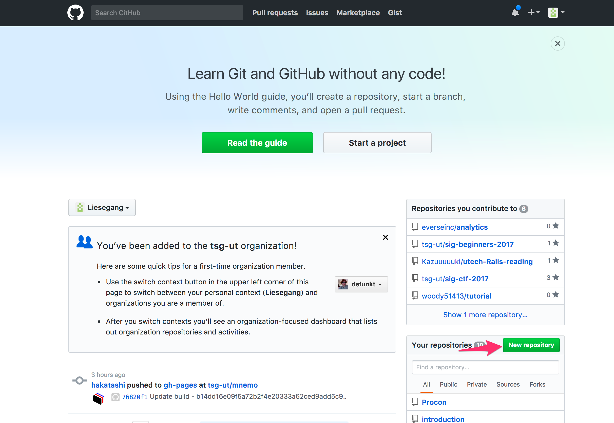
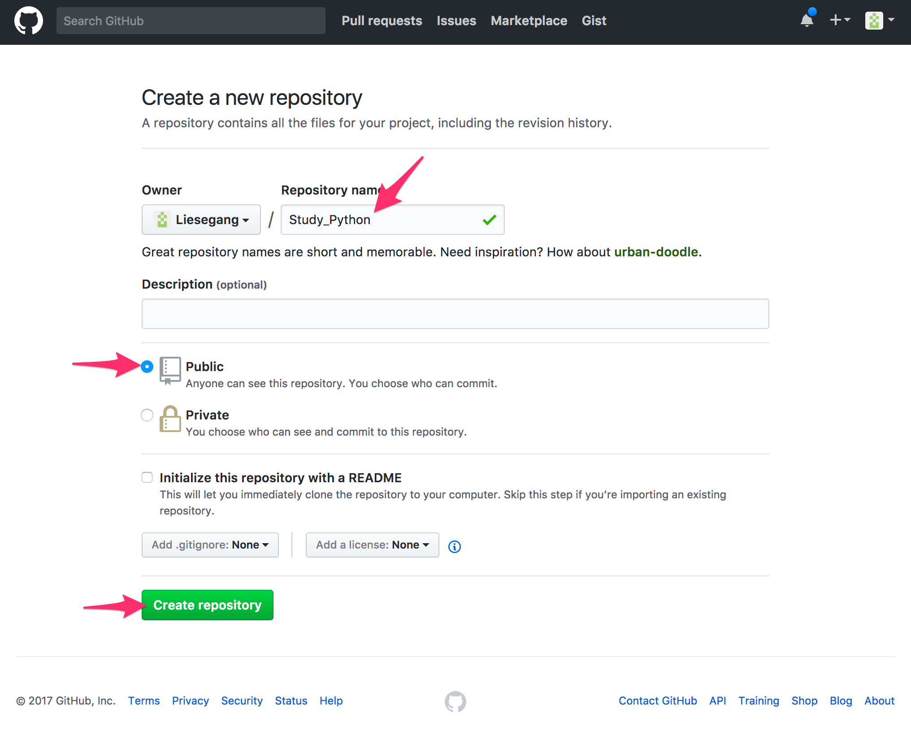
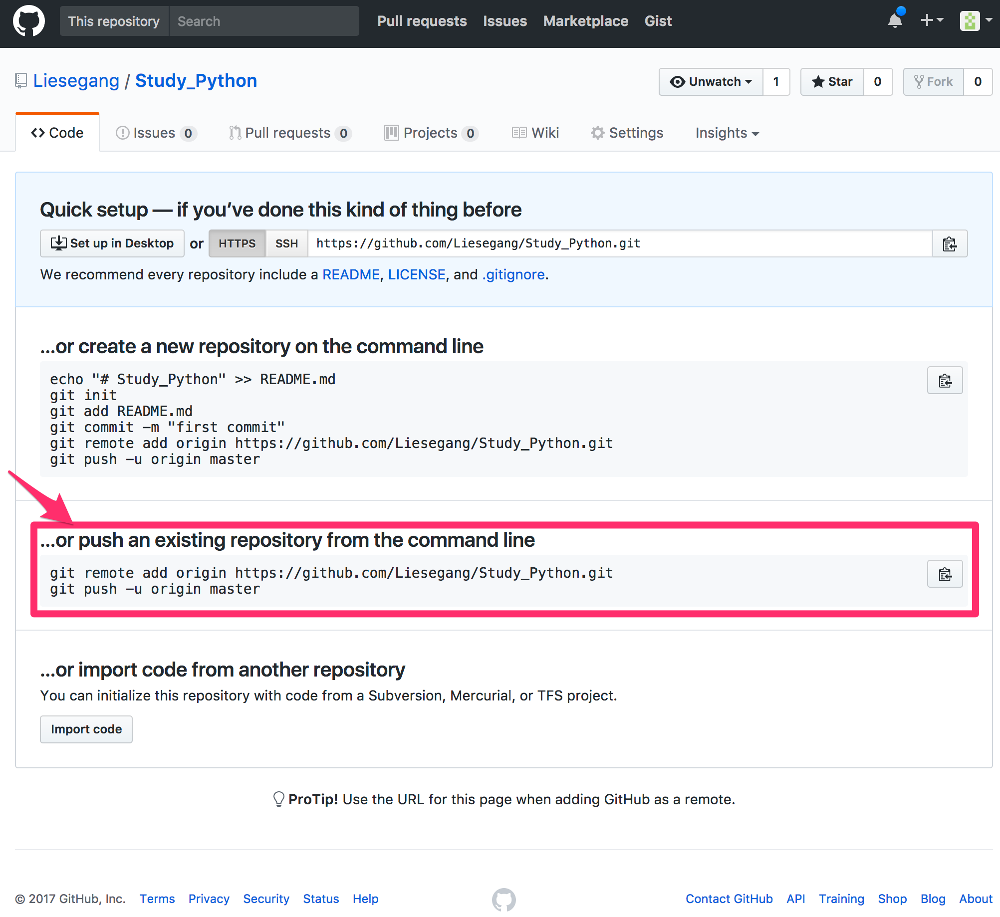

# 初心者分科会 第3回

## 今日の内容
+ Python のコードを整理するレポジトリを作ろう
+ Pythonをやるよ
+ Pythonの概要

## Python のコードを整理するレポジトリを作ろう

1. 適当なディレクトリに行く
~~1. `git init`してそのディレクトリをGitで管理することを宣言する~~
~~1. `Study_Python`というディレクトリを作る~~
1. `Study_Python`というディレクトリを作る
1. `Study_Python`というディレクトリに移動する
1. `git init`してそのディレクトリをGitで管理することを宣言する
ごめんなさい，書く順番を間違えていました…
1. ファイルを作る
```python3
print("Hello, Python!")
```
上記の内容を書いた`00_hello.py`というファイルを作りましょう
1. `git add .`する
1. `git commit -m "initial commit"`する
1. ブラウザで github を開き，ログインする
1. 新しいレポジトリを作成


1. ローカルレポジトリをリモートレポジトリにPush

赤線枠内のコマンドを実行

## Pythonをやるよ(前回の内容に加筆したもの)

### Pythonの概要

+ この分科会ではPython3を扱います(Python2ではないので注意)
+ Python2 と Python3 は完全な互換性はない

### Pythonの実行方法
Pythonには，
+ インタプリタで対話しながら実行する方法
+ ファイルにスクリプトを書いて実行する方法
の２種類がある

#### インタプリタで実行する方法
+ temrinalなどを開いて`python`を実行する

### ファイルにスクリプトを書いて実行する
+ `hello.py`というファイルがあったら，`python hello.py`とうてば実行できる
+ ちなみに，`python -i hello.py` のように`-i`オプションを付けると，スクリプトが終了した後にインタプリタモードになる．

### インデントについて
+ Pythonでは，インデントで，ブロックを判断します
+ インデントには，空白2つ，または4つがおすすめ．(タブはデメリットが有るらしい)
+ 以下はだめな例
```python3
if True:
print("真")
else:
print("偽")
```
+ 以下は正しい例
```python3
if True:
    print("真")
else:
    print("偽")
```

### 表示，文字列

1. `git checkout -b print`
2. 以下の内容を`01_print.py`で保存
3. `python 01_print.py`
4. add, commit
5. masterにチェックアウト
6. git merge print

```python3
# hello.py
print("Hello, Python3!")
# => Hello, Python3!\n
#最後に改行が付く

print("hello", "python3")
# => hello python3\n
# 引数を複数与えると空白を間に入れて出力してくれる

print("hello, Python3!", end="")
print("hello, Python3!", end="")
print("hello, Python3!")
# => Hello, Python3!
# => end="" を引数に与えれば，最後に改行はつかない

x = "Hello"
y = 'Hello'
print(x == y)
# 文字列は " と ' のどちらで囲んでも良い
```

### 変数

1. `git checkout -b variable`
2. 以下の内容を`02_variable.py`で保存
3. `python 02_variable.py`
4. add, commit
5. masterにチェックアウト
6. git merge variable

```python3
x = 1
# 変数を使用するのに，特に宣言はいらない

x = "Hello"
# 途中で型を変えても大丈夫

print(y)
# 何も代入していない変数を使おうとするとエラーが出る
```


### if

1. ブランチを作り
2. 以下の内容を保存して実行
3. add, commit
4. masterにマージ

```python3
n = 10

if n % 15 == 0:
    print("Fizz Buzz")
elif n % 3 == 0:
    print("Fizz")
elif n % 5 == 0:
    print("Buzz")
else:
    print(n)
# インデントに注意
# インデントの前には:を書く
# else if の代わりに elif が使う
```

### スクリプト実行のときだけ実行
```
if __name__=="__main__":
    print("スクリプト実行の時のみ実行される")
# 決まり文句なので覚えましょう
# ちなみに，スクリプト実行でないときとは，importで読み込まれたときのこと(だと思う)
```

### for
+ pyton には each っぽい for しかありません
+ Cみたいに `for(int i = 0; i < 10; ++i)` みたいにはできない
```python3
s = 0
for i in range(1,11): # 1~10まで繰り返す．11までではないので注意
    s += i
print(s)

```
+ break, continueがある
  + break: 一番内側のfor, whileを中断する
  + continue: for,while内の，その後の処理を飛ばしてループを再開
```python3
for i in range(0, 50):
  print(i)
  if i >= 10:
    break
#=>0 1 2 3 4 5 6 7 8 9

for i in range(0, 10):
  if i % 2 == 0:
    continue
  print(i)
#=>1 3 5 7 9
```

+ for に対して else が使える
```python3
import math

n = 101

for i in range(2, int(math.sqrt(n) + 1)):
    if n % i == 0:
        print(n, "は素数ではありません")
        break
else:
    print(n, "は素数です")
# else は for の中で break しなかった場合に実行される
# for の中身が1度も実行されなくても実行されるので注意
```


### range
+ range はかなり自由が効く
```python3
for i in range(10):
  print(i)
#=>0 1 2 3 4 5 6 7 8 9

for i in range(5,10):
  print(i)
#=>5 6 7 8 9

for i in range(1,10,2):
  print(i)
#=>1 3 5 7 9
#増加量を決められる

for i in range(10, 0, -1):
  print(i)
#=>10 9 8 7 6 5 4 3 2 1
#負の増加量も扱える
```


### while
```python3
love = 0
while True:
    love += 1

# c++でこんなコードを書いて，僕はこんなに愛してるとかいうネタが有った
# ちなみにc++では，コンパイラが最適化してloveという変数の存在自体がなくなる
```

### 関数
```python3

def gcd(a=252, b=105):
    if b == 0:
        return a
    else:
        return gcd(b, a % b)

gcd()
# デフォルト引数が使える

gcd(1232, 2352)
# 通常の呼び出し

gcd(b=4385, a=2895)
# 呼び出しのときに，引数名を指定できる(この場合意味はないが．)
# キーワード引数という

gcd(c=123)
# 指定されてない引数を与えるとエラーになる
```

```python3
def printer(a, b, **args):
    print('a:', a)
    print('b:', b)
    for key in args:
      print('!', key, args[key])

printer(a='apple', b='banana', c='candy', d='donuts', e='Eclair')
# キーワード引数で余分に与えられたものを，dictionary型(そのうち扱う)で回収することができる

def printer2(a, *args):
    print(a)
    print(args)

printer2('apple', 'banana', 'candy', 'donuts')
# これも，余分に与えられた引数を回収できるが，呼び出しのときにキーワード引数の形で渡されなあったものに対して使う
# これによって可変長の引数を受け取れる(例：print())
```

```python3
# 関数は，オブジェクトのように扱える
def add3(x=10):
    return x + 3

print(add3(5))

print(add3)

f = add3

print(f(5))
```
