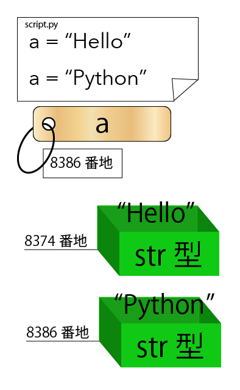

# 初心者分科会 第5回


## やること
+ 復習
+ Scopeの話
+ Moduleについて
+ オブジェクト指向について
+ Classについて


## 復習


### 名前(変数)，オブジェクト，参照について

+ 名前とは，オブジェクトの参照が格納されているもの
+ 参照とは，オブジェクトの場所を指し示すもの(住所のようなもの)
+ 例えば，`a="Hello"`と実行すると，str型の"Hello"というデータを持つオブジェクトの参照が，名前aに代入される

+ `a="Python"`のようにaに新しい文字列を代入すると，新しいオブジェクトが作られ，その参照がaに代入される



## Scopeの話

以下は，cPython の実装での話をしている．

### 名前空間とは？

+ 名前空間とは，名前が所属している領域のこと
+ 普通は，関数によって区切られる
+ その領域では，名前とオブジェクトの対応がディクショナリによって保持されている(そのディクショナリは，locals()で確認できる)
+ ある名前空間が属するModuleの持つ名前空間をglobalといい，どこからでもglobals()で確認できる
+ globalは，同じModuleないならどこからでもアクセスできる

例えば，
```python3
def a():
	# 関数a内部の名前空間
	l = 0
	s = 'apple'

	def b():
		# 関数a内部の名前空間
		m = 1
		t = 'banana'
		print('in function b:', locals())
		print('in global from b:', globals())

	print('in function a:',locals())
	b()

# globalの名前空間
n = 2
u = 'cake'
a()
print('in global:', globals())

#=>in function a: {'b': <function a.<locals>.b at 0x104c29488>, 's': 'apple', 'l': 0}
#=>in function b: {'t': 'banana', 'm': 1}
#=>in global from b: {'__name__': '__main__', '__doc__': None, '__package__': None, '__loader__': <class '_frozen_importlib.BuiltinImporter'>, '__spec__': None, '__annotations__': {}, '__builtins__': <module 'builtins' (built-in)>, 'a': <function a at 0x10910eea0>, 'n': 2, 'u': 'cake'}
#=>in global: {'__name__': '__main__', '__doc__': None, '__package__': None, '__loader__': <class '_frozen_importlib.BuiltinImporter'>, '__spec__': None, '__annotations__': {}, '__builtins__': <module 'builtins' (built-in)>, 'a': <function a at 0x10910eea0>, 'n': 2, 'u': 'cake'}
```
とすると，関数aの内部，関数b内部と，globalに全部で3つの名前空間ができ，

+ 関数a内部では `{l: 0, s: 'apple', b: 関数オブジェクトb}`
+ 関数b内部では `{m: 1, t: 'banana'}`
+ 関数b内部から見たglobalには `{a: 関数オブジェクトa, n: 2, u: 'banana', など}`
+ globalには `{a: 関数オブジェクトa, n: 2, u: 'banana', など}`

というデータを含む


### Scopeとは？

+ Scopeとは，ある名前空間から(直接)アクセスすることができる名前空間の範囲のこと
+ 直接アクセスするとは`a.b`のように`.`を使って対象を指定せず，`b`のようにアクセスする方法のこと
+ Scopeは視野のようなものであり，ある場所に立ったとき，そこから見える名前空間はどこまでかということである
+ 基本的に，自分より外側の名前が，スコープに含まれる
+ スコープにはいくつかの種類がある


### 名前を検索するときの，名前空間の優先順位

+ 名前を評価すると，それに対応するオブジェクトを探すために，その名前を持つ名前空間の検索が始まる
+ 何も指定していなければ以下の順に名前が検索される
	1. local(自分の関数内)
	2. nonlocal(localでもglobalでもない中間領域)のうち，よりlocalに近い内側のものから先に検索される
	3. global(自分のModule)
	4. builtins(len(), print(), str()などが入っている)
		+ より正確には`__builtins__`の属性を検索しているみたい

`print(spam)`がある名前空間から見た，Scope


+ `builtins` は `import builtins`を行うことで見ることができる
+ builtinsがglobalより後に検索されていることがわかる
```python3
import builtins
builtins.spam = "hello"

print(spam)
#=>hello

spam = "python"
print(spam)
#=>python
```

### local以外に代入するならば，Scopeを指定せよ
+ localでない名前に代入する時は，新しくlocalの変数を作ってしまわなうようにscopeを指定しなければならない

例えば
```python3
spam = 0
def a():
	spam = 1

a()
print(spam)
#=>0
```

+ 指定できるScopeの種類は3種類あり，それぞれが上で述べた階層に対応する
	+ local
	+ nonlocal
	+ global
+ Scopeを指定することで，そのScope内から名前を探すことができる

```python3
def scope_test():
    def do_local():
        spam = "local spam"

    def do_nonlocal():
        nonlocal spam
        spam = "nonlocal spam"

    def do_global():
        global spam
        spam = "global spam"

    spam = "test spam"
    do_local()
    print("After local assignment:", spam)
    do_nonlocal()
    print("After nonlocal assignment:", spam)
    do_global()
    print("After global assignment:", spam)

scope_test()
print("In global scope:", spam)

#=>After local assignment: test spam
#=>After nonlocal assignment: nonlocal spam
#=>After global assignment: nonlocal spam
#=>In global scope: global spam
```

### クロージャ

+ 関数は，定義されたときの周りの環境を保持している
+ 関数が定義されたときに，名前に対応するオブジェクトが見つかっていれば(=束縛されていれば)，呼び出し時の環境に同じ変数があっても影響を受けない
+ 束縛されているとき
```python3
def return_i():
	def a():
		return i
	i=0
	return a

f = return_i()

i=10

print(f())
#=>0
```

+ 束縛されていないとき
```python3
def return_i():
	def a():
		return i
	return a

f = return_i()

i=10

print(f())
#=>10
```


## Moduleについて

### Moduleとは？

便利な機能をまとめて，他のプログラムから利用できるようにしたファイルのこと

スクリプトモードで実行されたスクリプトや，インタプリタモードで書いたコマンドは，main Module に属する

```python3
# my_module.py

def func():
	pass

PI = 3.14
```

### Packageとは？

Moduleを機能ごとにディレクトリに分けて保存したもの

昔はディレクトリ内に`__init__.py`が必須だった．いつからか要らなくなったらしい

`__init__.py`で，Packageを読み込んだときの初期化処理を定義できる

```
- my-package
  |
  |- __init__.py
  |- sub_package1
  |  |- __init__.py
  |  |- module1.py
  |
  |- sub_package2
     |- __init__.py
     |- module2.py
     |- module3.py
```

### importとは？

Module や Module 内のオブジェクトを，global名前空間に束縛すること

例えば
```python3
import my_module

print(locals())
#=>{'__name__': '__main__', '__doc__': None, '__package__': None, '__loader__': <class '_frozen_importlib.BuiltinImporter'>, '__spec__': None, '__annotations__': {}, '__builtins__': <module 'builtins' (built-in)>, 'my_module': <module 'my_module' from '#####'>}
```
my_moduleがmain Module の my_moduleに束縛された

### Moduleをimportする方法

3種類ある

#### import A

A という名前に <Module object A> が束縛される


#### import A as B

B という名前に <Module object A> が束縛される


#### from A import B

B という名前に Module A の中の オブジェクトB が束縛される

`from A import *`とすると module A の中のオブジェクトがすべて import されるが，名前空間が汚れる(多くの名前が名前空間に登録される)ため，推奨されない


### 相対import

Package内で，近くの階層にある Module を読み込むときに相対参照のようなものが使える

```
- my-package
  |
  |- __init__.py
  |- sub_package1
  |  |- __init__.py
  |  |- module1.py
  |
  |- sub_package2
     |- __init__.py
     |- module2.py
     |- module3.py
```

という状態で，
+ module3.py から module2.py を import するなら `from . import module2.py`
+ module1.py から module2.py を import するなら `from ..sub_package2 import module2.py`

`.`が増えるごとにより上の階層に戻る


### Package を読み込むときの注意

上と同じ状況で，main から module1.pyを読み込みたいとき
```python3
import my_package

my_package.sub_package.module1.***
```
というようにはできない

正しくは
```python3
import my_package.sub_package.module1

my_package.sub_package.module1.***
```
または
```python3
from my_package.sub_package import module1

module1.***
```
とする


## pipを使おう

pip とは，pythonのパッケージマネージャです．

https://pypi.python.org/pypi/

にあるパッケージの，インストール，アンインストール，検索，インストールされているものの一覧を表示するなどを，楽にしてくれます．

### pip のインストール

#### windows

http://qiita.com/zkangaroo/items/4bb48b405e1651f2e273#pipインストール

#### mac 

もう入ってるんじゃないかな…？

## オブジェクト指向について

### オブジェクト指向

データと，そのデータに対して適応できる操作をまとめたものである，オブジェクトを中心として，プログラミングしていく手法


### オブジェクト指向の目的

+ 再利用性

他の工業の分野では，再利用が盛んに行われている．例えば，回路のICや，車のパーツ(エンジン，タイヤなど)，PCのパーツ(メモリ，HDD，CPUなど)．しかし，プログラミングの分野では行われてこなかった．クラスを，再利用の単位(=部品，パーツ)にすることによって，再利用しやすくする．

再利用性を高めることにより，同じものを何度も使わなくていいため(車輪の再発明を防ぐ)，開発のスピードを高めることができる．また，しっかり整備されたものを使うことによって，バグや脆弱性を防ぐことができる．


+ 拡張性

変更や，バグで修正が必要なとき，オブジェクト指向で開発をしていると，同じ機能の部分があちらこちらに散らばっているという状況が起きにくいため，比較的容易に修正することができる

また，後から要素を追加しなければならないときも，何を実装しなければならないかがはっきりわかることが多いため，容易に行える．


### クラス，オブジェクト

まず，クラスという型を作る．このクラスには，オブジェクトに適応できる Method(操作) とオブジェクトが持つデータの受け皿である Attribute(データ) が定義される

```python3
class Car:
	"""Car(kind :str)"""
	d = ['North', 'East', 'South', 'West']
	def __init__(self, kind):
		# Attributes
		self._kind = kind
		self._verosity = 0
		self._direction = 0

	# Methods
	# コマンド
	def speed_up(self, dv):
		self._verosity += dv

	def speed_down(self, dv):
		self._verosity -= dv

	def turn_right(self):
		self._direction += 1
		self._direction %= 4

	def turn_left(self):
		self._direction -= 1
		self._direction %= 4

	# 問い合わせ]
	def kind(self):
		return self._kind

	def info(self):
		return "Verosity is {}km/h\nDirection is {}".format(self._verosity, self.d[self._direction])
```

クラスとは，オブジェクトを作るための雛形のようなものであり，クラスから，そのクラスを型として持つオブジェクト(インスタンス)を作る
```python3
my_car = Car('Toyota')
print(my_car.info())

print()

my_car.speed_up(10)
my_car.turn_right()
print(my_car.info())
```


### クラス

```python3
class Animal:
	pass

a = Animal()
print(a)
#=><__main__.Animal object at 0x102464cf8>
```